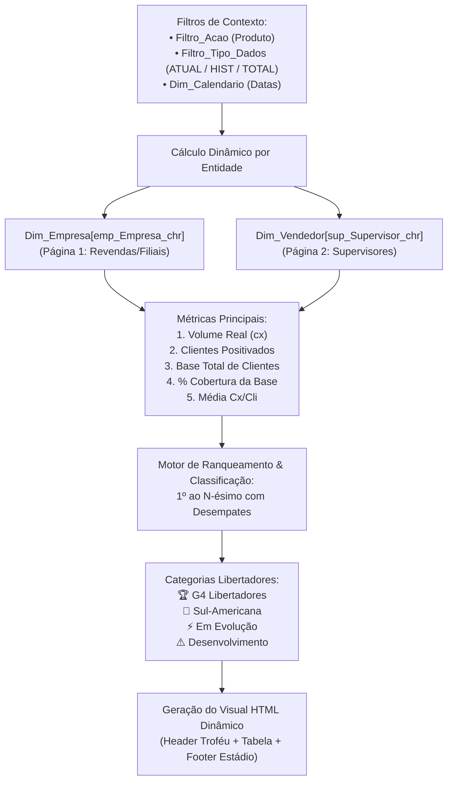

# Plano de Implementação: Páginas de Ranking por Revenda e Supervisor (PBIP)

> **Objetivo:** Implementar duas páginas dinâmicas no projeto Power BI (`ICE_ULTRA.pbip`), uma agrupada por **Revendas / Filiais** e outra por **Supervisores**, monitorando o desempenho das ações da campanha (**Crystal Ice**, **Petra Ultra** e **Ação Total**) com base nas métricas reais de **Volume (Caixas)** e **% Base de Clientes (Cobertura/Positivação)**, com capacidade de filtrar **ATUAL / HIST / TOTAL**, seguindo fielmente a identidade visual e layout do mockup da Libertadores (`WhatsApp Image 2026-09-17 at 09.59.55.jpeg`).

---

## 1. Diagnóstico e Alinhamento com o Feedback do Usuário

- **Feedback 1:** *"Era só pra se basear no mockup e criar páginas no PBIP para ver por revenda e por supervisor as ações, com base no vol/%base cliente"*.
- **Feedback 2 (Adicionado):** *"Isso! Quero poder filtrar também ATUAL / HIST"*.
- **Solução Definitiva:** 
  1. Utilizar a estrutura visual do mockup (troféu Libertadores, iluminação noturna de estádio, badges de categorias G4/Sul-Americana/Evolução, formatação condicional verde/amarela/vermelha).
  2. Substituir o `DATATABLE` estático por **DAX dinâmico de agregação em tempo real**, calculando **Volume de Caixas** e **% Base de Clientes** para cada Revenda/Filial e cada Supervisor.
  3. **Filtro Dinâmico de Período (ATUAL / HIST / TOTAL):**
     - Criar a tabela calculada `Filtro_Tipo_Dados` no modelo semântico.
     - Permitir alternar entre:
       - **Total Acumulado:** Histórico + Hoje (V2 Preço: `[QTD_..._PRECO_V2]`) — *Padrão*
       - **Histórico (HIST):** Vendas faturadas até D-1 (`[QTD_..._HIST_V2]`)
       - **Hoje / Atual (ATUAL):** Vendas do dia em tempo real (`[QTD_..._ATUAL_V2]`)
  4. Respeitar todos os filtros de contexto do relatório:
     - `Filtro_Acao` (Total Ação, Crystal Ice, Petra Ultra)
     - `Filtro_Tipo_Dados` (Total, Histórico, Atual)
     - `Filtro_Ranking_Motor` (Volume, Positivação, % Base)
     - `Dim_Calendario` (Intervalo de datas)

---

## 2. Arquitetura das Métricas DAX e Agrupamentos



### 2.1. Matriz de Medidas por Filtro de Ação e Tipo de Dados (ATUAL / HIST / TOTAL)

#### A. Volume de Vendas (Caixas):
| Tipo de Dados Selecionado | Ação Total (1) | Crystal Ice (2) | Petra Ultra (3) |
| :--- | :--- | :--- | :--- |
| **1. Total (HIST + ATUAL)** *(Padrão)* | `[QTD_ACAO_ULTRACRYSTAL_V2]` | `[QTD_ICE_PRECO_V2]` | `[QTD_P_ULTRA_PRECO_V2]` |
| **2. Somente HIST** | `[QTD_ACAO_HIST_V2]` | `[QTD_ICE_HIST_V2]` | `[QTD_P_ULTRA_HIST_V2]` |
| **3. Somente ATUAL (Hoje)** | `[QTD_ACAO_ATUAL_V2]` | `[QTD_ICE_ATUAL_V2]` | `[QTD_P_ULTRA_ATUAL_V2]` |

#### B. Clientes Positivados:
| Tipo de Dados Selecionado | Ação Total (1) | Crystal Ice (2) | Petra Ultra (3) |
| :--- | :--- | :--- | :--- |
| **1. Total (HIST + ATUAL)** *(Padrão)* | `[QTD CLI TOTAL ACAO V2]` | `[TOTAL CLI ICE V2]` | `[TOTAL PETRA ULTRA V2]` |
| **2. Somente HIST** | Calculado via `DISTINCTCOUNT` com `QTD_ACAO_HIST_V2 > 0` | `[QTD CLI ICE HIST V2]` | `[QTD CLI PETRA ULTRA HIST V2]` |
| **3. Somente ATUAL (Hoje)** | Calculado via `DISTINCTCOUNT` com `QTD_ACAO_ATUAL_V2 > 0` | `[QTD CLI ICE ATUAL V2]` | `[QTD CLI PETRA ULTRA ATUAL V2]` |

#### C. Base de Clientes e Cobertura:
- **Base de Clientes:** `[_Base_Cli_WTH]` (com fallback em `[_Base_Cli_TT]` ou `SUM(Dim_Vendedor[Meta_Cad])`).
- **% Cobertura da Base:** `IF(Base > 0, (Clientes Positivados / Base) * 100, 0)`.
- **Média Cx / Cliente:** `IF(Clientes Positivados > 0, Volume / Clientes Positivados, 0)`.

---

## 3. Tabela Calculada de Filtro: `Filtro_Tipo_Dados`

Será adicionada ao modelo semântico `ICE_ULTRA.SemanticModel` na tabela `Filtro_Tipo_Dados.tmdl`:

```dax
DATATABLE(
    "Tipo_Dados", STRING,
    "Codigo", INTEGER,
    {
        {"Total Acumulado (HIST + ATUAL)", 1},
        {"Somente Histórico (HIST)", 2},
        {"Somente Hoje (ATUAL)", 3}
    }
)
```

Essa tabela poderá ser utilizada como um **slicer nativo** no relatório do Power BI, e as medidas DAX de ranking a consultarão via `SELECTEDVALUE(Filtro_Tipo_Dados[Codigo], 1)`.

---

## 4. Especificação das Medidas DAX

### 4.1. Medida: `Ranking_Tendencia_Filiais_HTML`
- **Tabela:** `Medidas_Ranking`
- **Iteração:** `ALLSELECTED(Dim_Empresa[emp_Empresa_chr])`
- **Colunas da Tabela HTML:**
  1. `#`: Posição no ranking (1º ao 6º) com destaque dourado para os líderes.
  2. `REVENDA / FILIAL`: Nome da empresa com ícone de localização (`📍 CD-TABATINGA`, `📍 CD-MANAUS`, etc.).
  3. `VOLUME REAL (CX)`: Total de caixas faturadas de acordo com o filtro de ação e período (Atual/Hist/Total).
  4. `CLIENTES POS.`: Quantidade distinta de clientes que compraram no período.
  5. `BASE CLIENTES`: Base de clientes cadastrados/ativos da filial.
  6. `% COBERTURA BASE`: Percentual de positivação sobre a base (`Clientes / Base`).
  7. `MÉDIA CX/CLI`: Intensidade de compra média por cliente.
  8. `CATEGORIA`: Badges Libertadores:
     - 🏆 `G4 - LIBERTADORES` (Top 2 ou % Cobertura alta - Verde/Dourado)
     - 🥈 `SUL-AMERICANA` (Posições intermediárias - Azul/Prata)
     - ⚡ `EM EVOLUÇÃO` (Laranja/Amarelo)
     - ⚠️ `DESENVOLVIMENTO` (Vermelho)
- **Linha de Totais:** Total consolidado somando Volume, Clientes Únicos, Base Total e % Cobertura Geral da Distribuidora.

### 4.2. Medida: `Ranking_Tendencia_Supervisores_HTML`
- **Tabela:** `Medidas_Ranking`
- **Iteração:** `ALLSELECTED(Dim_Vendedor[sup_Supervisor_chr])`
- **Colunas da Tabela HTML:**
  1. `#`: Posição no ranking geral de supervisores.
  2. `SUPERVISOR`: Nome do supervisor e tag com a Filial correspondente (`CALCULATE(SELECTEDVALUE(Dim_Empresa[emp_Empresa_chr]))`).
  3. `VOLUME REAL (CX)`: Volume total vendido pela equipe do supervisor.
  4. `CLIENTES POS.`: Clientes positivados pela equipe do supervisor.
  5. `BASE CLIENTES`: Base de clientes atendida pela equipe do supervisor.
  6. `% COBERTURA BASE`: Percentual de clientes positivados na carteira do supervisor.
  7. `MÉDIA CX/CLI`: Média de caixas por cliente positivado.
  8. `CATEGORIA`: Classificação em faixas de desempenho.
- **Rolagem e Responsividade:** Container com rolagem vertical suave para acomodar 10 a 30 supervisores mantendo o cabeçalho fixo (`position: sticky`).

---

## 5. Design e Layout Baseados no Mockup Libertadores

- **Banner Superior (Header):** Imagem em base64 (`[HeaderTendenciaBase64]`) com troféu Libertadores 3D e iluminação de estádio.
- **Barra de Indicadores e Pílulas:**
  - Badge indicando a visão atual (`🏢 Revendas / Empresa / Filial` ou `👥 Supervisores`).
  - Indicador da ação selecionada (`Ação Total`, `Crystal Ice` ou `Petra Ultra`).
  - Indicador do período selecionado (`📊 Total Acumulado`, `📅 Histórico (HIST)` ou `⚡ Hoje (ATUAL)`).
  - Botões rápidos/links para alternar entre as páginas.
- **Formatação Condicional de Células (Cores do Mockup):**
  - **Verde Esmeralda (`#008a38`):** Excelente cobertura ou volume elevado (ex: Cobertura >= 60%).
  - **Amarelo / Âmbar (`#f5a623`):** Cobertura média (ex: 40% a 59,9%).
  - **Vermelho Carmim (`#cc1818`):** Cobertura baixa (ex: < 40%).
- **Banner Inferior (Footer):** Imagem em base64 (`[FooterTendenciaBase64]`) com torcida e holofotes de estádio.

---

---

## 6. Estrutura das Páginas no PBIP (`ICE_ULTRA.Report`)

As páginas do relatório foram implementadas e configuradas com visual HTML Content:

1. **Página 1: Ranking Filiais**
   - **ID:** `5da0d243bd2b47029575`
   - **Nome no menu:** `Ranking Filiais`
   - **Visual Container:** `htmlContent443BE3AD55E043BF878BED274D3A6865`
   - **Medida vinculada:** `Medidas_Ranking[Ranking_Tendencia_Filiais_HTML]`
   - **Dimensões:** 1536 x 1024 px (FitToPage)

2. **Página 2: Ranking Supervisores**
   - **ID:** `f659040bebe240a29fdf`
   - **Nome no menu:** `Ranking Supervisores`
   - **Visual Container:** `htmlContent443BE3AD55E043BF878BED274D3A6865`
   - **Medida vinculada:** `Medidas_Ranking[Ranking_Tendencia_Supervisores_HTML]`
   - **Dimensões:** 1536 x 1080 px (FitToPage)

3. **Página 3: Ranking Sub-Gerente Regional (Gerência MAO)**
   - **ID:** `b48d19bc2e104f7c89a1`
   - **Nome no menu:** `Ranking Sub-Gerente Regional`
   - **Visual Container:** `htmlContent443BE3AD55E043BF878BED274D3A6865`
   - **Medida vinculada:** `Medidas_Ranking[Ranking_Supervisores_SubGerente_HTML]`
   - **Dimensões:** 1536 x 1080 px (FitToPage)

---

## 7. Agrupamentos Regionais Virtuais (Estrutura de Gestão)

### 7.1. GERÊNCIA MAO (Amazonas) — Implementada
Compreende as 4 praças do Amazonas sob gestão do Sub-Gerente Regional:
- **`CD-MANAUS`** (8 supervisores): Rafael Oliveira, Jarlison Junior, Ermeson Barbosa, Ediomar Grijo, Marcone Carvalho, Thiago Negreiros, Jhonison Serrão, Bruno Bandeira.
- **`CD-ITACOATIARA`** (1 supervisor): Cadmiel Aquino de Souza.
- **`CD-PARINTINS`** (1 supervisor): Adson Binda Gomes.
- **`CD-TABATINGA`** (1 supervisor): Pedro Paulo Silva dos Santos.
- **Total Regional MAO:** 11 Supervisores.

### 7.2. GERÊNCIAS FUTURAS (Roadmap)
- **`GERENCIA BOV`**: Exclusiva para a praça de **`CD-BOA VISTA`** (Roraima).
- **`GERENCIA MCP`**: Exclusiva para a praça de **`CD-MACAPA`** (Amapá).

---

## 8. Motores de Preço / Modalidade (`Filtro_Modalidade_Preco`)

- **NA AÇÃO (Preço Mínimo)**: Contabiliza apenas os pedidos que respeitam as faixas de preço mínimo parametrizadas da campanha.
- **GERAL (Todos os Preços / Bonificados / Combos)**: Contabiliza todo o volume e positivação de Crystal Ice e Petra Ultra, independente do preço praticado (preço zero/bonificações e combos). Permite auditar e identificar a disseminação de volume fora das regras da ação.

---

## 9. Etapas Concluídas

1. **Criação das Tabelas de Filtro:**
   - `definition/tables/Filtro_Tipo_Dados.tmdl` (Total, Histórico, Atual).
   - `definition/tables/Filtro_Modalidade_Preco.tmdl` (Na Ação vs. Geral).
   - Registradas em `definition/model.tmdl`.
2. **Implementação das Medidas DAX em `Medidas_Ranking.tmdl`:**
   - `[Ranking_Tendencia_Filiais_HTML]`, `[Ranking_Tendencia_Supervisores_HTML]`, `[Ranking_Supervisores_SubGerente_HTML]`.
   - Medidas GERAIS de volume e positivação (`[QTD_TOTAL_GERAL]`, `[QTD_ICE_GERAL]`, `[QTD_P_ULTRA_GERAL]`, etc.).
3. **Atualização da Identidade Visual dos Banners:**
   - Troca de "RANKING DE TENDÊNCIA" para apenas **"RANKING"** em estilo 3D metálico/dourado (`[HeaderTendenciaBase64]`).
   - Contraste corrigido: texto branco (`#ffffff`) e amarelo ouro (`#fbbf24`) nas células de fundo azul marinho.
4. **Criação e Registro das Páginas PBIP:**
   - Configuração de `5da0d243bd2b47029575`, `f659040bebe240a29fdf` e `b48d19bc2e104f7c89a1` em `pages.json`.
5. **Mockups Autônomos Atualizados:**
   - `Mockup/ranking_tendencia_filiais.html`
   - `Mockup/ranking_tendencia_supervisores.html`
   - `Mockup/ranking_subgerente_regional.html`
